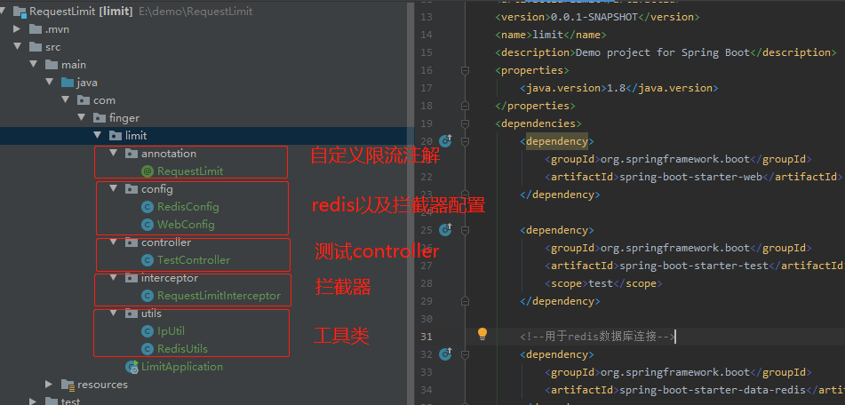

# RequestLimit

```markdown
使用redis实现简单的接口限流
```

```markdown
1、自定义限流注解
```
```java
/**
 * create by: lixh
 * description: 自定义限流注解
 * create time: 2021/8/4 9:35
 * @return
 */
@Inherited
@Documented
@Target({ElementType.FIELD, ElementType.TYPE, ElementType.METHOD})
@Retention(RetentionPolicy.RUNTIME)
public @interface RequestLimit {
 
    /**
     * 时间内  秒为单位
     */
    int second() default 10;
 
    /**
     *  允许访问次数
     */
    int maxCount() default 5;
 
    //默认效果 ： 10秒内 对于使用该注解的接口，只能总请求访问数 不能大于 5次
}
```
```markdown
2、两个配置类
```
```java
package com.finger.limit.config;

import com.fasterxml.jackson.annotation.JsonAutoDetect;
import com.fasterxml.jackson.annotation.PropertyAccessor;
import com.fasterxml.jackson.databind.ObjectMapper;
import org.springframework.cache.CacheManager;
import org.springframework.cache.annotation.EnableCaching;
import org.springframework.context.annotation.Bean;
import org.springframework.context.annotation.Configuration;
import org.springframework.data.redis.cache.RedisCacheConfiguration;
import org.springframework.data.redis.cache.RedisCacheManager;
import org.springframework.data.redis.connection.RedisConnectionFactory;
import org.springframework.data.redis.core.RedisTemplate;
import org.springframework.data.redis.core.StringRedisTemplate;
import org.springframework.data.redis.serializer.Jackson2JsonRedisSerializer;
import org.springframework.data.redis.serializer.RedisSerializationContext;
import org.springframework.data.redis.serializer.StringRedisSerializer;
 
import static org.springframework.data.redis.cache.RedisCacheConfiguration.defaultCacheConfig;
 
/**
 * create by: lixh
 * description: TODO
 * create time: 2021/8/4 9:36
 * @return
 */
@Configuration
@EnableCaching
public class RedisConfig {
    @Bean
    public CacheManager cacheManager(RedisConnectionFactory connectionFactory) {
        RedisCacheConfiguration cacheConfiguration =
                defaultCacheConfig()
                        .disableCachingNullValues()
                        .serializeValuesWith(RedisSerializationContext.SerializationPair.fromSerializer(new Jackson2JsonRedisSerializer(Object.class)));
        return RedisCacheManager.builder(connectionFactory).cacheDefaults(cacheConfiguration).build();
    }
 
 
    @Bean
    public RedisTemplate<String, Object> redisTemplate(RedisConnectionFactory factory) {
        RedisTemplate<String, Object> redisTemplate = new RedisTemplate<>();
        redisTemplate.setConnectionFactory(factory);
        Jackson2JsonRedisSerializer jackson2JsonRedisSerializer = new Jackson2JsonRedisSerializer(Object.class);
        ObjectMapper om = new ObjectMapper();
        om.setVisibility(PropertyAccessor.ALL, JsonAutoDetect.Visibility.ANY);
        om.enableDefaultTyping(ObjectMapper.DefaultTyping.NON_FINAL);
        jackson2JsonRedisSerializer.setObjectMapper(om);
        //序列化设置 ，这样为了存储操作对象时正常显示的数据，也能正常存储和获取
        redisTemplate.setKeySerializer(new StringRedisSerializer());
        redisTemplate.setValueSerializer(jackson2JsonRedisSerializer);
        redisTemplate.setHashKeySerializer(new StringRedisSerializer());
        redisTemplate.setHashValueSerializer(jackson2JsonRedisSerializer);
        return redisTemplate;
    }
    @Bean
    public StringRedisTemplate stringRedisTemplate(RedisConnectionFactory factory) {
        StringRedisTemplate stringRedisTemplate = new StringRedisTemplate();
        stringRedisTemplate.setConnectionFactory(factory);
        return stringRedisTemplate;
    }
 
}
```
```java
package com.finger.limit.config;

import com.finger.limit.interceptor.RequestLimitInterceptor;
import org.springframework.beans.factory.annotation.Autowired;
import org.springframework.context.annotation.Configuration;
import org.springframework.web.servlet.config.annotation.InterceptorRegistry;
import org.springframework.web.servlet.config.annotation.WebMvcConfigurer;
 

/**
 * create by: lixh
 * description: TODO
 * create time: 2021/8/4 9:36
 * @return
 */
@Configuration
public class WebConfig implements WebMvcConfigurer {
    @Autowired
    private RequestLimitInterceptor requestLimitInterceptor;
 
    @Override
    public void addInterceptors(InterceptorRegistry registry) {
        registry.addInterceptor(requestLimitInterceptor)
 
                //拦截所有请求路径
                .addPathPatterns("/**")
                //再设置 放开哪些路径
                .excludePathPatterns("/static/**","/auth/login");
    }
 
}
```
```markdown
3、自定义限流拦截器
```
```java
package com.finger.limit.interceptor;

import com.fasterxml.jackson.databind.ObjectMapper;
import com.finger.limit.annotation.RequestLimit;
import com.finger.limit.utils.IpUtil;
import org.slf4j.Logger;
import org.slf4j.LoggerFactory;
import org.springframework.beans.factory.annotation.Autowired;
import org.springframework.data.redis.core.RedisTemplate;
import org.springframework.stereotype.Component;
import org.springframework.web.method.HandlerMethod;
import org.springframework.web.servlet.HandlerInterceptor;
 
import javax.servlet.http.HttpServletRequest;
import javax.servlet.http.HttpServletResponse;
import java.io.IOException;
import java.util.concurrent.TimeUnit;
 
/**
 * create by: lixh
 * description: 限流拦截器
 * create time: 2021/8/4 9:36
 * @return
 */
 
@Component
public class RequestLimitInterceptor implements HandlerInterceptor {
    private final Logger log = LoggerFactory.getLogger(this.getClass());
 
    @Autowired
    private RedisTemplate<String, Object> redisTemplate;
 
    @Override
    public boolean preHandle(HttpServletRequest request, HttpServletResponse response, Object handler) throws Exception {
        try {
            if (handler instanceof HandlerMethod) {
                HandlerMethod handlerMethod = (HandlerMethod) handler;
                // 获取RequestLimit注解
                RequestLimit requestLimit = handlerMethod.getMethodAnnotation(RequestLimit.class);
                if (null==requestLimit) {
                    return true;
                }
                //限制的时间范围
                int seconds = requestLimit.second();
                //时间内的 最大次数
                int maxCount = requestLimit.maxCount();
                String ipAddr = IpUtil.getIpAddr(request);
                // 存储key
                String key =  ipAddr+":"+request.getContextPath() + ":" + request.getServletPath();
                // 已经访问的次数
                Integer count = (Integer) redisTemplate.opsForValue().get(key);
                log.info("检测到目前ip对接口={}已经访问的次数{}", request.getServletPath() , count);
                if (null == count || -1 == count) {
                    redisTemplate.opsForValue().set(key, 1, seconds, TimeUnit.SECONDS);
                    return true;
                }
                if (count < maxCount) {
                    redisTemplate.opsForValue().increment(key);
                    return true;
                }
                log.warn("请求过于频繁请稍后再试");
                returnData(response);
                return false;
            }
            return true;
        } catch (Exception e) {
            log.warn("请求过于频繁请稍后再试");
            e.printStackTrace();
        }
        return true;
    }
 
    public void returnData(HttpServletResponse response) throws IOException {
        response.setCharacterEncoding("UTF-8");
        response.setContentType("application/json; charset=utf-8");
        ObjectMapper objectMapper = new ObjectMapper();
        //这里传提示语可以改成自己项目的返回数据封装的类
        response.getWriter().println(objectMapper.writeValueAsString("请求过于频繁请稍后再试"));
        return;
    }
 
}
```
```markdown
4、两个工具类
```
```java
package com.finger.limit.utils;

import javax.servlet.http.HttpServletRequest;
import java.net.InetAddress;
import java.net.UnknownHostException;
 
/**
 * @Author : JCccc
 * @CreateTime : 2018-11-23
 * @Description :
 * @Point: Keep a good mood
 **/
public class IpUtil {
    public static String getIpAddr(HttpServletRequest request) {
        String ipAddress = null;
        try {
            ipAddress = request.getHeader("x-forwarded-for");
            if (ipAddress == null || ipAddress.length() == 0 || "unknown".equalsIgnoreCase(ipAddress)) {
                ipAddress = request.getHeader("Proxy-Client-IP");
            }
            if (ipAddress == null || ipAddress.length() == 0 || "unknown".equalsIgnoreCase(ipAddress)) {
                ipAddress = request.getHeader("WL-Proxy-Client-IP");
            }
            if (ipAddress == null || ipAddress.length() == 0 || "unknown".equalsIgnoreCase(ipAddress)) {
                ipAddress = request.getRemoteAddr();
                if (ipAddress.equals("127.0.0.1")) {
                    // 根据网卡取本机配置的IP
                    InetAddress inet = null;
                    try {
                        inet = InetAddress.getLocalHost();
                    } catch (UnknownHostException e) {
                        e.printStackTrace();
                    }
                    ipAddress = inet.getHostAddress();
                }
            }
            // 对于通过多个代理的情况，第一个IP为客户端真实IP,多个IP按照','分割
            if (ipAddress != null && ipAddress.length() > 15) { // "***.***.***.***".length()
                // = 15
                if (ipAddress.indexOf(",") > 0) {
                    ipAddress = ipAddress.substring(0, ipAddress.indexOf(","));
                }
            }
        } catch (Exception e) {
            ipAddress="";
        }
        // ipAddress = this.getRequest().getRemoteAddr();
 
        return ipAddress;
    }
}
```
```java
package com.finger.limit.utils;

import org.springframework.beans.factory.annotation.Autowired;
import org.springframework.data.redis.core.*;
import org.springframework.stereotype.Component;
import java.io.Serializable;
import java.util.List;
import java.util.Set;
import java.util.concurrent.TimeUnit;


@Component
public class RedisUtils {
 
 
    @Autowired
 
    private RedisTemplate redisTemplate;
 
 
    /**
     * 写入String型 [ 键，值]
     *
     * @param key
     * @param value
     * @return
     */
 
    public boolean set(final String key, Object value) {
        boolean result = false;
        try {
            ValueOperations<Serializable, Object> operations = redisTemplate.opsForValue();
            operations.set(key, value);
            result = true;
        } catch (Exception e) {
            e.printStackTrace();
        }
        return result;
 
    }
 
 
 
  /**
     * 写入String型,顺便带有过期时间 [ 键，值]
     *
     * @param key
     * @param value
     * @return
     */
 
    public boolean setWithTime(final String key, Object value,int seconds) {
        boolean result = false;
        try {
 
            ValueOperations<Serializable, Object> operations = redisTemplate.opsForValue();
            operations.set(key, value,seconds, TimeUnit.SECONDS);
            result = true;
        } catch (Exception e) {
            e.printStackTrace();
        }
        return result;
 
    }
 
 
 
    /**
     * 批量删除对应的value
     *
     * @param keys
     */
 
    public void remove(final String... keys) {
        for (String key : keys) {
            remove(key);
        }
    }
 
    /**
     * 批量删除key
     *
     * @param pattern
     */
 
    public void removePattern(final String pattern) {
        Set<Serializable> keys = redisTemplate.keys(pattern);
        if (keys.size() > 0)
            redisTemplate.delete(keys);
    }
 
    /**
     * 删除对应的value
     *
     * @param key
     */
 
    public void remove(final String key) {
        if (exists(key)) {
            redisTemplate.delete(key);
        }
    }
 
 
    /**
     * 判断缓存中是否有对应的value
     *
     * @param key
     * @return
     */
 
    public boolean exists(final String key) {
        return redisTemplate.hasKey(key);
    }
 
 
    /**
     * 读取缓存
     *
     * @param key
     * @return
     */
 
    public Object get(final String key) {
        Object result = null;
        ValueOperations<Serializable, Object> operations = redisTemplate.opsForValue();
        result = operations.get(key);
        return result;
    }
 
 
    /**
     * 哈希 添加
     * hash 一个键值(key->value)对集合
     *
     * @param key
     * @param hashKey
     * @param value
     */
 
    public void hmSet(String key, Object hashKey, Object value) {
 
        HashOperations<String, Object, Object> hash = redisTemplate.opsForHash();
 
        hash.put(key, hashKey, value);
 
    }
 
 
    /**
     * Hash获取数据
     *
     * @param key
     * @param hashKey
     * @return
     */
 
    public Object hmGet(String key, Object hashKey) {
        HashOperations<String, Object, Object> hash = redisTemplate.opsForHash();
        return hash.get(key, hashKey);
 
    }
 
 
    /**
     * 列表添加
     * list:lpush key value1
     *
     * @param k
     * @param v
     */
 
    public void lPush(String k, Object v) {
        ListOperations<String, Object> list = redisTemplate.opsForList();
        list.rightPush(k, v);
    }
 
 
    /**
     * 列表List获取
     * lrange： key 0 10 (读取的个数 从0开始 读取到下标为10 的数据)
     *
     * @param k
     * @param l
     * @param l1
     * @return
     */
 
    public List<Object> lRange(String k, long l, long l1) {
        ListOperations<String, Object> list = redisTemplate.opsForList();
        return list.range(k, l, l1);
    }
 
 
    /**
     * Set集合添加
     *
     * @param key
     * @param value
     */
 
    public void add(String key, Object value) {
        SetOperations<String, Object> set = redisTemplate.opsForSet();
        set.add(key, value);
    }
 
 
    /**
     * Set 集合获取
     *
     * @param key
     * @return
     */
 
    public Set<Object> setMembers(String key) {
 
        SetOperations<String, Object> set = redisTemplate.opsForSet();
 
        return set.members(key);
 
    }
 
 
    /**
     * Sorted set :有序集合添加
     *
     * @param key
     * @param value
     * @param scoure
     */
 
    public void zAdd(String key, Object value, double scoure) {
        ZSetOperations<String, Object> zset = redisTemplate.opsForZSet();
        zset.add(key, value, scoure);
    }
 
 
    /**
     * Sorted set:有序集合获取
     *
     * @param key
     * @param scoure
     * @param scoure1
     * @return
     */
 
    public Set<Object> rangeByScore(String key, double scoure, double scoure1) {
 
        ZSetOperations<String, Object> zset = redisTemplate.opsForZSet();
 
        return zset.rangeByScore(key, scoure, scoure1);
 
    }
 
 
    /**
     * 根据key获取Set中的所有值
     *
     * @param key 键
     * @return
     */
 
    public Set<Integer> sGet(String key) {
        try {
            return redisTemplate.opsForSet().members(key);
        } catch (Exception e) {
            e.printStackTrace();
            return null;
        }
    }
 
 
    /**
     * 根据value从一个set中查询,是否存在
     *
     * @param key   键
     * @param value 值
     * @return true 存在 false不存在
     */
 
    public boolean sHasKey(String key, Object value) {
        try {
            return redisTemplate.opsForSet().isMember(key, value);
        } catch (Exception e) {
            e.printStackTrace();
            return false;
        }
    }
 
}
```
```markdown
5、测试
```
```java
package com.finger.limit.controller;

import com.finger.limit.annotation.RequestLimit;
import org.springframework.web.bind.annotation.GetMapping;
import org.springframework.web.bind.annotation.RestController;
 
 
/**
 * create by: lixh
 * description: 测试
 * create time: 2021/8/4 9:34
 * @return
 */
@RestController
public class TestController {
    @GetMapping("/test")
    @RequestLimit(maxCount = 3,second = 60)
    public String test() {
        return "成功";
    }
}
```